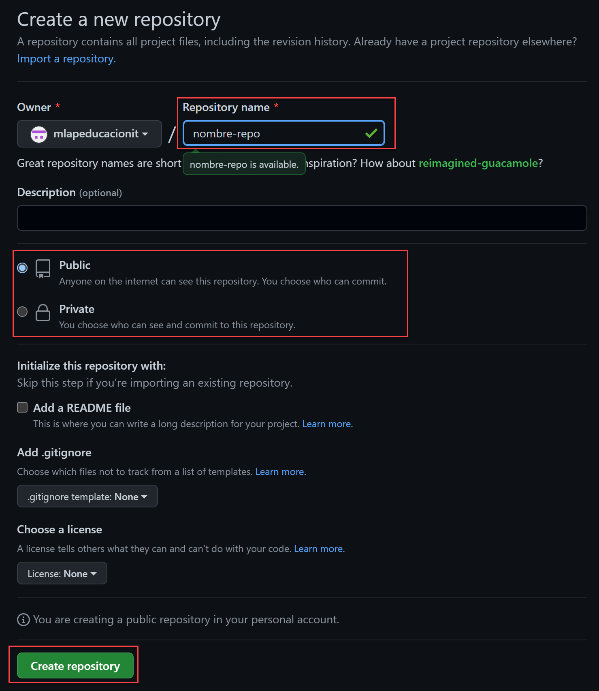
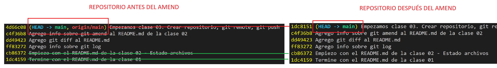
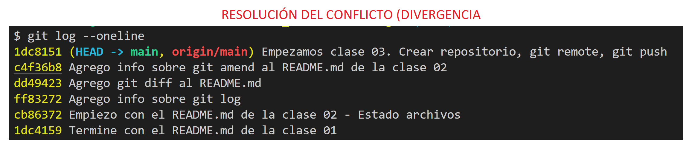

# Clase 03

## Crear repositorio en GitHub



### Si el repo no esta creado

```sh
…or create a new repository on the command line
echo "# nombre-repo" >> README.md
git init
git add README.md
git commit -m "first commit"
git branch -M main
git remote add origin https://github.com/mlapeducacionit/nombre-repo.git
git push -u origin main
```

### Si el repo local esta creado

…or push an existing repository from the command line

```sh
git remote add origin https://github.com/mlapeducacionit/nombre-repo.git
git branch -M main # No es necesario
git push -u origin main
```

## GIT REMOTE
Si quiero saber si tengo un remoto

```sh
git remote
```

> Más detalle sobre los remotos

```sh
git remote -v
```

> Para agregar un remoto

```sh
git remote add <alias> <url-del-remoto>
```

## Si quiero subir al repositorio remoto el local

> La primera vez

```sh
git push -u <alias-del-remoto> <rama-local-que-quiero-subir>
git push -u origin main
```

> Las siguientes veces que quiera subir

```sh
git push
```

## Resolver el conflicto. 
Cuando hay una diferencia entre la historia (Los hashes) del local con los del remoto







```sh
git push -f # Fuerza la subida de lo que está en el repo local.
```

## GITGNORE
Me permite ignorar archivos que no quiero que pertenezcan al repositorio. El gitignore se coloca en la raíz del proyecto.

## GITKEEP
Lo creo la comunidad para incluir en los repositorios carpetas vacías.


