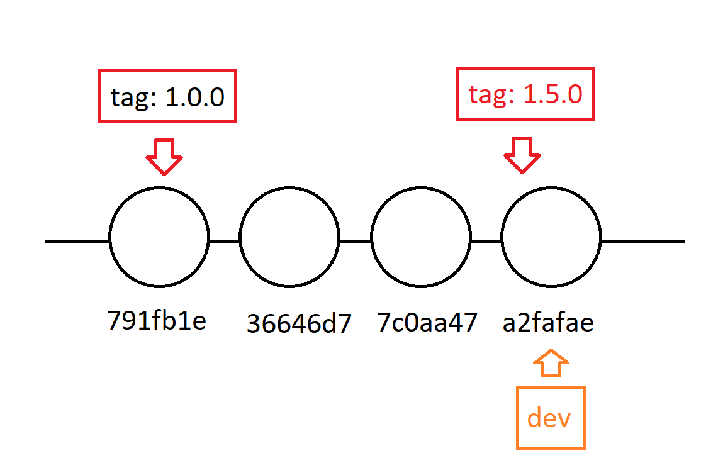

# Clase 06

Me sirven para marca por las diferentes versiones de mi aplicación. Y marcan un commit. Apunta a ese commit el tag.

## Crear un tag

Esto crea un tag en el último commit en la rama que este.

```sh
git tag hice-un-tag
```

## Otra forma de crear un tag

```sh
git tag -a v1.0.0 -m "Esta versión número 1.0.0" # Crea un tag en el último commit
git tag -a v1.0.0 -m "Esta versión número 1.0.0" <HASH> # Crea un tag en el commit especificado
git tag -a v0.1.0 -m "Esta versión número 0.1.0" 4d04d44 
```

## Ver información sobre el tag

```sh
git show <HASH> #Me muestra información solamente del commit
git show fa48e4e
git show <TAG> # Me muestra información sobre el tag y el commit
git show v1.0.0 
```

## Borrar un tag local.

```sh
git tag -d <TAG>
git tag -d <hice-un-tag>
```

## Borrar un tag remote.

```sh
git push --delete origin <TAG>
git push --delete origin v0.1.0
```

## Punteros



### Punteros estaticos

* Branches, tags

### Puntero dinamico

* HEAD

### Utilizar HEAD como refencia. 

HEAD^4: Selecciona 4 commit por debajo de head

## Subir tags

### Subir un tag en especifico.

```sh
git push origin <TAG>
```

### TODO. No recomendado. Porque me sube todos los tags.

```sh
git push --tags # No es buena practica
```

## Trabajar en proyectos Open Source (Pull Request)

1. Hacer un fork del proyecto. Del proyecto del cual quiero contribuir (Me voy copiar en mi cuenta el repo del proyecto original)
2. Me clono el fork desde mi cuenta github
3. Trabajo normalmente. Subo los cambios (A repo propio)
4. Me voy al proyecto original en el apartado Pull Request. Creo un nuevo Pull Request. Algunas veces aparece en mi repo la posibilidad Pull Request.
---
5. Si el repo original sufrió más modificaciones. (Commits). Voy a tener que actualizar mi fork.
6. Voy a la cuenta del proyecto original y me copio la url del repositorio
7. Y agrego en mi repositorio local, la url (el remoto) del proyecto original.

    git remote upstream <URL-repositorio-original>

8. Me traigo los cambios del repositorio original a mi repo local

    git pull upstream <rama-que-quiero-actualizar>

9. Subo a mi repositorio remoto (Fork) las actualizaciones del repo local

    git push origin <rama-a-actualizar>

## GITHUB CLI
Es un herramienta para interacturar con los repositorios remotos de GITHUB

<https://cli.github.com/>


## GIST
Compartir código, pasar snippet a otras personas o información que quiero compartir.

<https://gist.github.com/>

Secretos => Solo la persona que tienen link puede verlo. No son privados
Publicos => Se van indexar en los motores de búsqueda

Pueden tener varios archivos y sus revisiones.


## Crear caratura o presentación de mi cuenta de github

Tengo que crear un repo con este nombre: mlapeducacionit

## GIT PAGES
Me permite alojar un sitio, estaticos. Aplicaciones React, Vue, Angular.
Hosting gratuito.

Respositorio que me crear una GitPages: mlapeducacionit.github.io

Hay que activar las GitHub Pages... 

Settings > Pages...

## GIT REBASE
Lo mismo que el merce. Si me quiero traer los cambios de otra rama, tengo que hacerl el rebaso sobre la rama actual y llamar a la rama que me quiero traer

```sh
git rebase <rama-origen>
git rebase reset
```

## REBASE Interactivo

```sh
git rebase -i
```

* Ordenar commits
* Corregir mensajes de los commits
* Unir commits
* Separar commits

